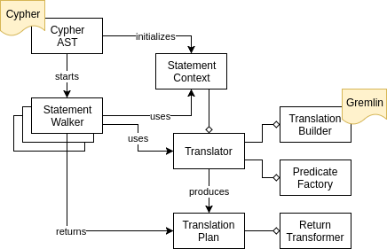

# Cypher to Gremlin Translation

The translation module provides facilities to:
- parse Cypher queries using the Cypher frontend,
- produce a translation to Gremlin,
- transform results to a format that is accepted by the target Gremlin Server implementation.

## Usage

### Translating Cypher

To translate a Cypher query to a Gremlin query:

```java
String cypher = "MATCH (p:Person) WHERE p.age > 25 RETURN p.name";
TranslationFacade cfog = new TranslationFacade();
String gremlin = cfog.toGremlin(cypher);
```

A bit more verbose version of the above, demonstrating several extension points:

```java
String cypher = "MATCH (p:Person) WHERE p.age > 25 RETURN p.name";
CypherAstWrapper ast = CypherAstWrapper.parse(cypher);
Translator<String, StringPredicate> translator = TranslatorFactory.string();
String gremlin = ast.buildTranslation(translator);
```

Note that `Translator` instances are not reusable. A new one has to be created for each `buildTranslation` call. `TranslationFacade` handles this for you.

Custom translation targets can be provided by implementing `TranslationBuilder` and `PredicateFactory`:

```java
Translator<String, StringPredicate> translator = new Translator<>(
    new MyTranslationBuilder(),
    new MyPredicateFactory()
); 
```

This is how all the different translation pieces fit together:



Consult the published Javadoc for more information.

### Running Cypher

You can use `TranslationFacade` to translate Cypher to Gremlin as a string, but you can also execute Cypher directly against a [`GraphTraversalSource`](https://tinkerpop.apache.org/docs/current/reference/#the-graph-process):

```java
TinkerGraph graph = TinkerFactory.createModern();
GraphTraversalSource traversal = graph.traversal();
CypherExecutor cypherExecutor = new CypherExecutor(traversal);
String cypher = "MATCH (p:Person) WHERE p.age > 25 RETURN p.name";
List<Map<String, Object>> results = cypherExecutor.execute(cypher);
```
